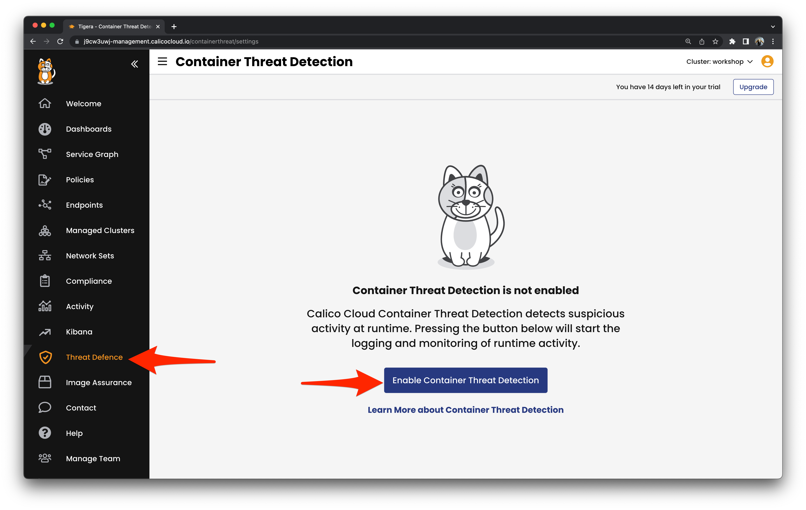
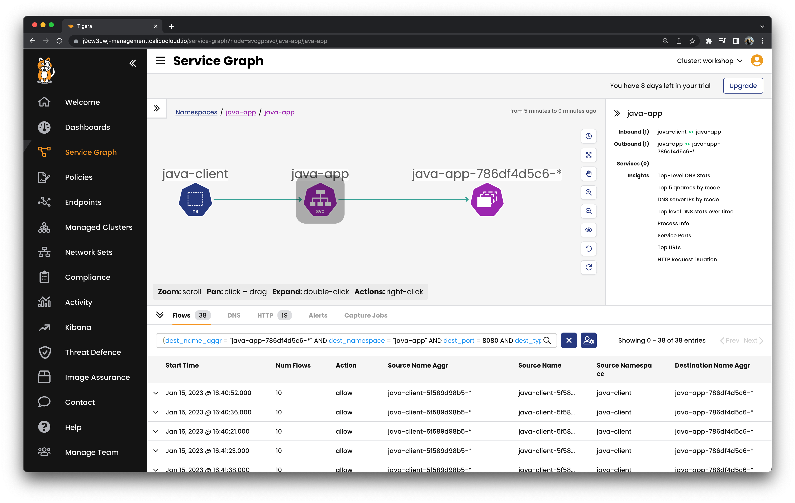

# Detection


## Enable Deep Packet Inspection

Detect exploitation attempts by evaluating workload traffic against intrusion detection signatures.

Calico Cloud's Kubernetes native deep packet inspection allows us to choose the java-app workload and examine the traffic against Snort signatures.

Take a look.

```
apiVersion: projectcalico.org/v3
kind: DeepPacketInspection
metadata:
  name: java-app-dpi
  namespace: java-app
spec:
  selector: 'app == "java-app"'
```

Enable deep packet inspection for the vulnerable java-app workload.

```
kubectl apply -f workshop/dpi
```

## Enable eBPF based Container Threat Detection

Detect the presence of malicious files and processes in compromised workloads.

Turn on Container Threat Detection for your cluster nodes in the Calico Cloud web ui.  Yes, it's really that easy.




## Dynamic Service and Threat Graph

Expose reconnaissance gathering, exploitation attempts, and data exfiltration of sensitive information. 

Collect the path and arguments of short-lived processes, low-level TCP logging, Calico Cloud flow, DNS, and application layer logging.
 
```
kubectl patch felixconfiguration default --patch-file workshop/felix/felix.yaml
kubectl apply -f workshop/dsg
```

Enable layer 7 logging for our vulnerable `java-app`.

```
kubectl annotate svc java-app -n java-app projectcalico.org/l7-logging=true
```



Setup alerting for suspicious DNS lookups and WAF ruleset matches.

```
kubectl apply -f workshop/alerts
```


[Next -> Module 6](exploitation.md)
